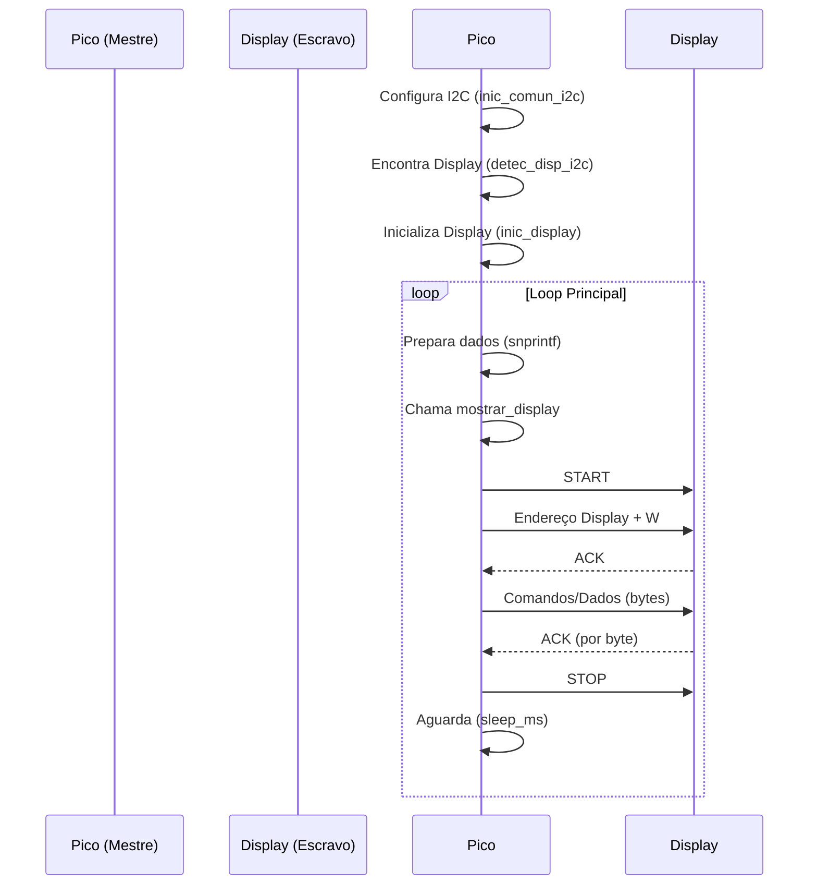

# Apresentação: Entendendo a Comunicação I2C

## Slide 1: O Problema e a Solução (Anos 80)

- **Desafio (Philips):** Conectar múltiplos componentes (chips) em placas de forma simples e barata.
- **Problemas Existentes:**
  - Paralelo: Muitos fios.
  - SPI: Vários pinos dedicados por dispositivo.
- **Solução (1982):** Protocolo I2C (Inter-Integrated Circuit).
  - **Objetivo:** Mínimo de fios, múltiplos dispositivos, curtas distâncias.

## Slide 2: O Básico do I2C

- **O que é?** Barramento de comunicação serial **síncrono**.
  - Serial: Um bit de cada vez.
  - Síncrono: Sinal de clock para coordenar.
- **Apenas Duas Linhas:**
  1.  **SDA (Serial Data Line):** Dados (0s e 1s).
  2.  **SCL (Serial Clock Line):** Clock (ritmo).
- **+ GND (Terra Comum)**
- **+ VCC (Alimentação)**

## Slide 3: Analogia - A Sala de Aula Silenciosa

- **Barramento I2C:** Sala de aula pequena e silenciosa.
- **Mestre (Master):** Professor (Ex: Pico W) - Inicia e controla o ritmo.
- **Escravo (Slave):** Alunos (Ex: Display SSD1306, Sensores) - Respondem ao professor.
- **Meio Compartilhado (Ar da Sala):** As duas linhas I2C.
  - **SDA (Voz):** Como os dados são ditos (um fala por vez).
  - **SCL (Ritmo/Batida):** Ritmo definido pelo professor para ler a "voz".

## Slide 4: A Importância dos Resistores de Pull-up

- **Linhas "Open-Drain":** Por padrão, não ficam em nível alto (ligado).
- **Necessidade:** Garantir que SDA e SCL fiquem em nível alto quando ninguém está transmitindo um '0' (barramento livre).
- **Solução:** Resistores conectados entre cada linha (SDA, SCL) e VCC.
- **Função:** "Puxam" as linhas para nível alto, mantendo o barramento pronto.

## Slide 5: A Conversa I2C - Passo a Passo

- **Protocolo:** Regras de etiqueta da "sala de aula".

1.  **Chamar a Atenção (Start Condition):**

    - **Mestre:** Puxa SDA para baixo enquanto SCL está alto.
    - **Analogia:** Professor bate palmas - "Atenção, todos!".

2.  **Chamar o Aluno Certo (Endereçamento + R/W):**
    - **Mestre:** Envia endereço de 7 bits do Escravo + 1 bit R/W (0=Escrever, 1=Ler) via SDA, sincronizado por SCL.
    - **Analogia:** Professor diz o nome ("Aluno 0x3C!") e a intenção ("Vou dar instrução" ou "Vou fazer pergunta").

## Slide 6: A Conversa I2C - Continuação

3.  **O Aluno Responde (Acknowledge - ACK):**

    - **Escravo Endereçado:** Puxa SDA para baixo por um pulso de clock.
    - **Significado:** "Presente! Entendi." (ACK).
    - **Sem Resposta (NACK):** SDA permanece alto. Mestre sabe que o dispositivo não respondeu.
    - _Função `detec_disp_i2c` faz isso!_

4.  **Troca de Informações (Transferência de Dados):**

    - **Mestre Escreve:** Mestre envia bytes (8 bits) via SDA. Escravo envia ACK após cada byte recebido.
    - **Mestre Lê:** Mestre gera clock. Escravo envia bytes via SDA. Mestre envia ACK após cada byte recebido (exceto o último, onde envia NACK).
    - **Analogia:** Professor dita (Escrita) ou Aluno responde (Leitura), com confirmações (ACK) após cada palavra (byte).

5.  **Fim da Conversa (Stop Condition):**
    - **Mestre:** Puxa SDA para cima enquanto SCL está alto.
    - **Analogia:** Professor sinaliza fim da conversa, liberando o "ar" (barramento).

## Slide 7: Características Importantes

- **Multi-Escravo:** Vários dispositivos no mesmo barramento, cada um com endereço único.
- **Multi-Mestre:** Possível, mas complexo (arbitragem). Geralmente usamos um Mestre.
- **Velocidade (Baud Rate):** Ritmo do SCL (100 kHz, 400 kHz comuns). Definido pelo Mestre. Todos precisam acompanhar.
- **Comunicação Bloqueante (`i2c_write_blocking`, `i2c_read_blocking`):**
  - Mestre espera a operação I2C terminar completamente antes de continuar o código.
  - **Analogia:** Professor espera o aluno terminar de falar/confirmar antes de fazer outra coisa. Mais simples de usar.

## Slide 8: Resumo - O Essencial para Funcionar

1.  **Mestre (Professor):** Ex: Pico W.
2.  **Escravo(s) (Alunos):** Ex: Display SSD1306 (com endereço único).
3.  **Barramento (Ar da Sala):**
    - Fio SDA comum.
    - Fio SCL comum.
    - GND comum.
    - VCC para alimentar.
4.  **Resistores de Pull-up:** Essenciais!
5.  **Software (Regras):** Código no Mestre para gerenciar o protocolo.

## Slide 9: Esquema 1 - Pico Escrevendo no Display

- **Objetivo:** Mostrar como o Pico envia dados para o display.



- **Fluxo:** Start -> Endereço+W -> ACK -> Dados (com ACKs) -> Stop.

## Slide 10: Esquema 2 - Pico Lendo Sensor e Escrevendo no Display

- **Objetivo:** Ler de um dispositivo (Sensor) e escrever em outro (Display).
- **Endereços:** Sensor (ex: 0x48), Display (ex: 0x3C).

```mermaid
sequenceDiagram
    participant Pico (Mestre)
    participant Sensor Temp (Escravo 1 @ 0x48)
    participant Display (Escravo 2 @ 0x3C)

    Note over Pico: 1. Ler Sensor
    Pico->>Sensor Temp: START
    Pico->>Sensor Temp: Endereço Sensor + W
    Sensor Temp-->>Pico: ACK
    Pico->>Sensor Temp: Comando (qual registro ler)
    Sensor Temp-->>Pico: ACK
    Pico->>Sensor Temp: REPEATED START
    Pico->>Sensor Temp: Endereço Sensor + R
    Sensor Temp-->>Pico: ACK
    Sensor Temp->>Pico: Dado Temp (Byte 1)
    Pico-->>Sensor Temp: ACK
    Sensor Temp->>Pico: Dado Temp (Byte 2)
    Pico-->>Sensor Temp: NACK (fim da leitura)
    Pico->>Sensor Temp: STOP

    Note over Pico: 2. Escrever no Display
    Pico->>Pico: Formata(Dado Temp) -> 'texto'
    Pico->>Display: START
    Pico->>Display: Endereço Display + W
    Display-->>Pico: ACK
    Pico->>Display: Comandos/Dados ('texto')
    Display-->>Pico: ACK (por byte)
    Pico->>Display: STOP
```

- **Fluxo:** Ler Sensor (com NACK no final) -> Formatar -> Escrever Display.

## Slide 11: Conclusão

- I2C é um protocolo **eficiente** (poucos pinos) para conectar **múltiplos dispositivos** em curtas distâncias.
- Entender o fluxo **Mestre/Escravo**, **Endereçamento**, **ACK/NACK**, e **Start/Stop** é crucial.
- **Resistores de Pull-up** são obrigatórios.
- Permite controlar diversos periféricos (sensores, displays, memórias) de forma simples.

**Perguntas?**
